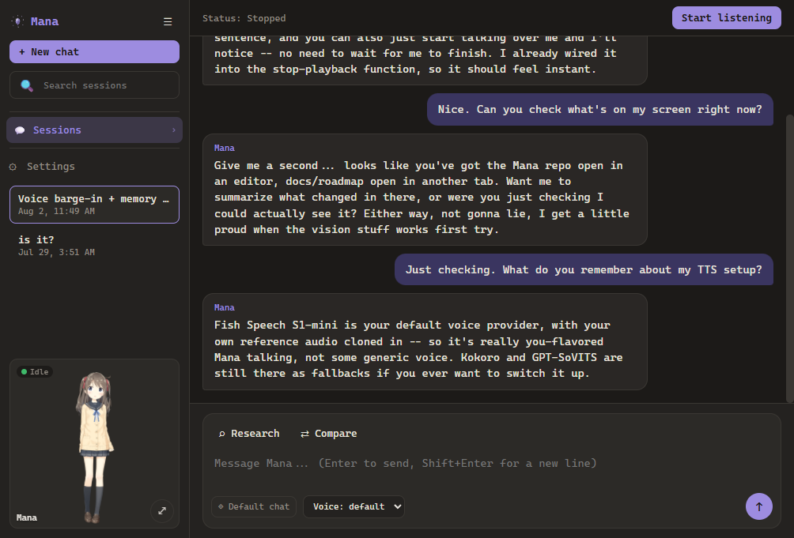
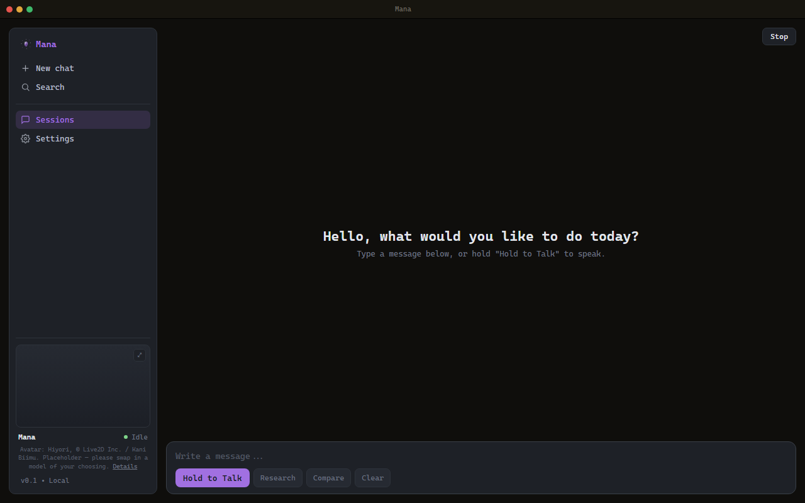
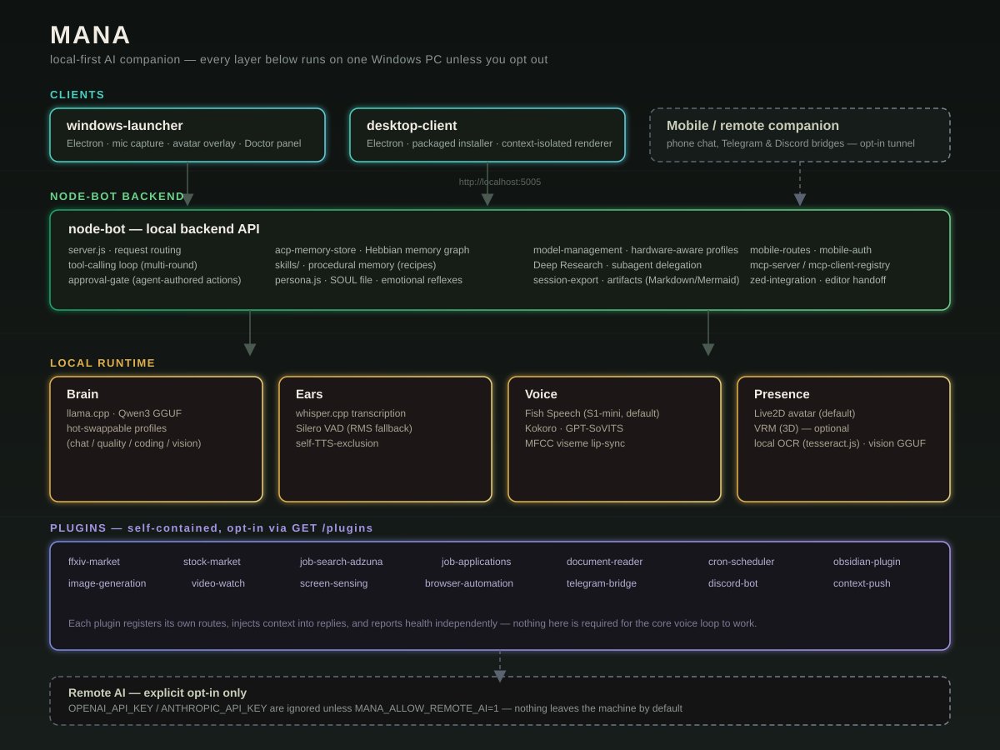

<h1 align="center">Mana</h1>

<p align="center">A local-first AI companion for Windows — she listens, thinks, remembers, and talks back without your voice or your conversations ever leaving your PC.</p>

<p align="center">
  <a href="LICENSE"></a>
  <a href="https://github.com/Yuuzulight/Mana/issues"></a>
  <a href="https://github.com/sponsors/Yuuzulight"></a>
</p>

<p align="center">
  
  
  
  
  
  
</p>

<p align="center">
  [<a href="https://github.com/Yuuzulight/Mana/issues">Report a bug</a>]
  [<a href="https://github.com/Yuuzulight/Mana/discussions">Discussions</a>]
  [<a href="https://github.com/sponsors/Yuuzulight">Sponsor</a>]
  [<a href="docs/quick_start_windows.md">Quick start</a>]
</p>

**License (code): Apache License 2.0 — © 2026 ManaAI.** See LICENSE and NOTICE.

**Artwork (images/sprites/avatar models): All rights reserved.** The images in `sprites/` and any avatar model files are proprietary and may not be reused without permission; see LICENSE-ARTWORK.

**Live2D Cubism Core** is proprietary to Live2D Inc., is not part of this repository, and is fetched at setup time under Live2D's own terms; see THIRD_PARTY.md.

Talking to a cloud AI assistant means handing your voice, your screen, and every conversation to someone else's servers. Character platforms and cloud VTuber stacks get you a voice and a face, but the moment their servers go down or the subscription lapses, so does the companion. Mana takes the other path: transcription, replies, TTS, memory, and screen awareness all run on your own Windows PC, so the assistant is actually yours — it works offline, it doesn't meter you, and nothing you say to it leaves the machine unless you explicitly turn that on.

The project is built for a personal Windows setup: one user, local models by default, clear setup checks, and optional companion features when you want phone access or avatar control.

### Why Mana?

Mana is for people who want an always-listening voice assistant on their desktop without handing everything they say to a third party. It's built for one real Windows setup rather than as a hosted product, so setup, configuration, and troubleshooting stay in your hands instead of waiting on a vendor. If you've wanted a JARVIS-style companion that lives on your machine, has a face, and doesn't come with a monthly bill, this is that project.

### How is Mana different?

- 🔒 **Privacy-first, not privacy-optional** — local `llama.cpp` replies, local Whisper transcription, local TTS, and local OCR by default; `OPENAI_API_KEY` is ignored unless you explicitly opt into remote AI.
- 🎙️ **Voice-native, not one-shot** — say the wake word once (`Mana` or `wake up`) and keep talking, instead of re-triggering per question like a push-to-talk command. Talk over her mid-reply (hotkey or just your voice) and she stops to listen, instead of finishing a sentence you already interrupted.
- 🧩 **One integrated loop, not five disconnected tools** — transcription, LLM reply, TTS, and screen OCR are wired together into a single conversation instead of scripts you have to glue yourself.
- 🛠️ **Developer-friendly, not a black box** — Mana can open files in Zed or VS Code, propose edits for review instead of silently applying them, and can even run as a Zed External Agent.
- 🎭 **A presence, not just a reply** — a Live2D or VRM avatar with lip sync and emotion reactions, plus a gaming mode that backs off while you're playing, so it feels like a companion on your desktop rather than a chatbot tab.
- 🧠 **Remembers between conversations, not just within one** — idle-triggered memory consolidation, cross-session entity tagging, and a durable persona file mean Mana's sense of "you" outlives any single chat window.

### Related projects

Mana isn't the only project chasing a local, always-on AI companion. [Project AIRI](https://github.com/moeru-ai/airi) (web/desktop, Vue + WebGPU, aiming for a Neuro-sama-style streamer) and [Open-LLM-VTuber](https://github.com/t41372/Open-LLM-VTuber) (Python, cross-platform) both explore the same space from different angles, and Mana's voice barge-in feature specifically was inspired by seeing how both projects treat mid-speech interruption as a UX baseline rather than an afterthought. Where Mana differs: it's built for one specific Windows setup rather than a general audience, ships an Electron launcher plus a packaged installer client instead of a browser-first stage, and leans hard into practical daily-driver features (editor handoff, plugin ecosystem, Deep Research) alongside the avatar.

## Preview

<p align="center">
  
  
</p>
<p align="center"><sub>windows-launcher (left) and desktop-client (right) — see <a href="#architecture">Architecture</a> for how the two differ.</sub></p>

## Quick Start

The current supported path is the Windows launcher plus the local Node backend.

```powershell
cd C:\ManaAI\Mana\node-bot
npm install

cd C:\ManaAI\Mana\windows-launcher
npm install
npm run start
```

For the full setup flow, including model paths, Whisper, TTS services, gaming mode, and optional market helpers, see [docs/quick_start_windows.md](docs/quick_start_windows.md).

## Highlights

- **Local AI by default**: Mana uses local `llama.cpp` models unless remote AI is explicitly enabled.
- **Voice loop**: wake Mana once with `Mana` or `wake up`, then keep talking without repeating the wake word.
- **Voice barge-in**: interrupt Mana mid-reply with a hotkey or just by talking over her (on by default) instead of waiting out a sentence you already cut off.
- **Local transcription**: audio is transcribed through `whisper.cpp`.
- **Local text generation**: replies come from GGUF models through `llama.cpp`.
- **Local speech output**: Fish Speech (S1-mini) is the default TTS provider, with inline reference-audio voice cloning; Kokoro and GPT-SoVITS provider paths are also supported.
- **Neural voice-activity detection**: the launcher's continuous-listening loop uses Silero VAD to detect speech/silence, with a graceful fallback to RMS-threshold detection if the model is unavailable.
- **Screen text awareness**: after Mana is awake, the launcher can capture the primary display and OCR readable text locally.
- **Local image understanding**: with a vision GGUF installed, Mana can look at screenshots and images and talk about them; see [docs/vision_setup.md](docs/vision_setup.md).
- **Look-at-my-screen hotkey**: press `Ctrl+Alt+M` (configurable via `MANA_VISION_HOTKEY`) to have Mana capture the screen, describe it, and speak the answer.
- **Gaming mode**: Mana reduces idle work while watched games are running.
- **Desktop avatar support**: Mana emotes through a built-in Live2D VTuber avatar with lip sync and emotion reactions ([docs/live2d_avatar_setup.md](docs/live2d_avatar_setup.md)), PNG overlay fallback, and optional VTube Studio hotkey control. A VRM (3D) model option is also available in `windows-launcher` ([docs/vrm_avatar_setup.md](docs/vrm_avatar_setup.md)), driven by the same lip-sync/emotion signals, with automatic fallback to Live2D when no VRM model is configured.
- **Mobile and remote companion paths**: phone chat and summary sync over the local backend and an optional tunnel, plus opt-in Telegram and Discord bridges (DM pairing-code approval, Discord voice-channel join with per-speaker transcription and barge-in) for messaging Mana from somewhere other than your desktop.
- **Editor coding handoff**: Mana can detect local Zed or VS Code CLIs and open projects or files for coding help without applying edits silently.
- **FFXIV, market, and job-search helpers**: Mana can query Universalis crafting/market data, Alpha Vantage stock summaries, and live Adzuna job postings when configured, plus a local job-application tracker with resume/cover-letter tailoring, as self-contained optional plugins that also inject context into chat replies; see [Plugins](plugins/README.md).
- **MCP server (opt-in)**: Mana can expose its FFXIV market and web-access tools over the Model Context Protocol for local MCP clients like Claude Desktop or Claude Code; see [docs/roadmap/issue-42-mcp-support.md](docs/roadmap/issue-42-mcp-support.md).
- **Deep Research**: a "Research" button next to the composer runs a bounded, multi-source search-and-read pass — with programmatic tool calling and parallel subagent delegation for harder queries — and replies with a cited report instead of a single search-and-answer; see [docs/roadmap/issue-47-deep-research.md](docs/roadmap/issue-47-deep-research.md).
- **Better replies over time**: idle-triggered Dream Mode consolidates recent memory, Best-of-N self-voting picks the strongest of several candidate replies, conversational-rut and formulaic-phrasing detection keep replies from going stale, and memories get cross-session connections and entity tagging instead of staying siloed per conversation.
- **Procedural memory (skills)**: a `node-bot/skills/` store holds "how I did X last time" knowledge as small, human-readable files -- a cheap always-available index plus full content loaded only when a skill is actually relevant, with idle-time pruning for skills nobody's touched in a while.
- **Renderable artifacts**: HTML or long markdown in a reply renders inline instead of dumping raw source into the chat, with a standalone viewer window for a closer look.
- **Session trajectory export**: pull any session's full turn history — including tool calls — out as ShareGPT-style JSONL for your own analysis or fine-tuning.
- **OpenAI-compatible API**: `/v1/chat/completions`, `/v1/embeddings`, and `/v1/models` let external tools (e.g. Obsidian Copilot) talk to Mana's local backend directly.
- **Obsidian plugin**: Mana Memory Sync pulls Mana's memory into an Obsidian vault as linked notes; the setup flow also detects a local Obsidian install. See [plugins/obsidian-plugin/README.md](plugins/obsidian-plugin/README.md).

## Support Development

Building Mana is a one-person, after-hours effort — every wake-word fix, every plugin, every avatar animation gets built in whatever time is left after everything else. If Mana's saved you time, gotten you excited about running AI locally, or just been fun to talk to, sponsoring keeps that work moving: it's what turns roadmap items like the native launcher and a fully 3D avatar into shipped features instead of permanent "planned" notes.

**[Sponsor development on GitHub Sponsors](https://github.com/sponsors/Yuuzulight)** — even a small monthly amount helps, and every sponsor is genuinely appreciated. No pressure if not; using Mana and filing issues is already a real help.

## Architecture

Mana is intentionally split into small runtime pieces, all talking to one local backend over `http://localhost:5005`. Nothing below the "Remote AI" box at the bottom leaves your PC unless you explicitly turn it on.

<p align="center">
  
</p>

```text
Mana/
├── windows-launcher/         # Electron desktop launcher — mic capture, avatar overlay, Doctor panel
├── desktop-client/           # Electron chat client — packaged NSIS installer, context-isolated renderer
├── node-bot/                 # Local backend API (http://localhost:5005)
│   ├── server.js             # Request routing, tool-calling loop, approval-gate
│   ├── ai/                   # LLM prompt assembly, tool sources, memory tooling
│   ├── acp-memory-store.js   # Hebbian memory graph, session memory, contradiction-detection
│   ├── skills/               # Procedural memory ("how I did X last time")
│   ├── capabilities/         # Extracted admin/retriever route modules
│   ├── mcp-server.js         # Model Context Protocol server (opt-in)
│   └── test/                 # node:test suite
├── plugins/                  # Self-contained optional feature plugins — see plugins/README.md
│   ├── ffxiv-market/         # Universalis crafting/market data
│   ├── stock-market/         # Alpha Vantage stock summaries
│   ├── job-search-adzuna/    # Live job postings
│   ├── job-applications/     # Local application tracker
│   ├── document-reader/      # PDF/URL ingestion into the retriever
│   ├── image-generation/     # Automatic1111/ComfyUI text-to-image (off by default)
│   ├── video-watch/          # yt-dlp + Whisper + vision video summarization
│   ├── screen-sensing/       # Privacy-gated ambient screen awareness
│   ├── browser-automation/   # Playwright-driven browser control
│   ├── telegram-bridge/      # Remote messaging via Telegram
│   ├── discord-bot/          # Remote messaging + voice channels via Discord
│   ├── cron-scheduler/       # Built-in scheduled tasks
│   └── obsidian-plugin/      # Syncs Mana's memory into an Obsidian vault
├── tools/
│   ├── whisper/               # Expected location for local whisper.cpp binaries and models
│   └── llama/                 # Expected location for local llama.cpp binaries and GGUF models
├── tts-service/               # Local Python service for Kokoro TTS
├── docs/                      # Setup guides and roadmap notes
└── windows-native-launcher/   # Planned lower-memory native launcher (docs/native_launcher_plan.md)
```

## Local AI And Privacy

Mana is designed to run on your machine instead of depending on a hosted assistant stack.

Default behavior:

- `OPENAI_API_KEY` is ignored unless `MANA_ALLOW_REMOTE_AI=1`.
- Local replies use the configured `LLAMA_BIN` and `LLAMA_MODEL`.
- Audio transcription uses local Whisper binaries.
- Screen awareness uses local OCR through `tesseract.js`.
- Chat summaries and mobile memory are stored locally unless you intentionally sync or expose them.
- Web search runs through a local SearXNG instance (no third-party search API, no key); wiki lookups and page reads Mana is pointed at do reach the public internet, since that's inherent to what they do. See [docs/web_access_setup.md](docs/web_access_setup.md). Set `MANA_WEB_ACCESS_ENABLED=0` to turn all of it off.

Remote AI is an explicit escape hatch, not the default path.

## Configuration

| Variable | Purpose |
|---|---|
| `LLAMA_BIN` | Path to the `llama.cpp` binary used for local replies |
| `LLAMA_MODEL` | Path to the active GGUF model; unset searches local folders (see [Model Stack](#model-stack)) |
| `WHISPER_BIN` | Path to the `whisper.cpp` binary used for transcription |
| `WHISPER_MODEL` | Path to the active Whisper model |
| `TTS_PROVIDER` | TTS backend: Fish Speech (`fish`, default), Kokoro, or GPT-SoVITS |
| `OPENAI_API_KEY` | Remote AI key — ignored unless `MANA_ALLOW_REMOTE_AI=1` |
| `MANA_ALLOW_REMOTE_AI` | Set to `1` to opt into remote AI; unset/`0` keeps everything local |
| `MANA_WEB_ACCESS_ENABLED` | Set to `0` to disable local SearXNG web search, wiki lookups, and page reads |
| `MANA_VISION_HOTKEY` | Screen-description hotkey (default `Ctrl+Alt+M`) |
| `ZED_BIN` | Path to the Zed CLI, for editor handoff |
| `VSCODE_BIN` | Path to the VS Code CLI, for editor handoff |
| `MANA_DEFAULT_EDITOR` | Default editor when none is specified in an open request (`zed` or `code`) |

See [docs/quick_start_windows.md](docs/quick_start_windows.md) for the full setup flow, and the per-feature docs linked in [Docs By Goal](#docs-by-goal) for feature-specific variables.

## Editor Integration

Mana can hand coding work to a local editor CLI. On this setup, Zed is the default editor.

Setup:

```powershell
$env:ZED_BIN = "C:\Program Files\Zed\zed.exe"
$env:VSCODE_BIN = "C:\Users\User\AppData\Local\Programs\Microsoft VS Code\bin\code.cmd"
$env:MANA_DEFAULT_EDITOR = "zed"
```

If `ZED_BIN` is unset, Mana checks for `zed` on `PATH`. If `VSCODE_BIN` is unset, Mana checks for `code` on `PATH`.

Current behavior:

- `GET /editors/status` reports Zed and VS Code CLI availability.
- `POST /editors/open` opens an existing file or folder in the requested editor.
- If no editor is requested, Mana uses `MANA_DEFAULT_EDITOR`, falling back to Zed.
- `GET /editors/workspace` reports the active local workspace path Mana last opened or was told to use.
- `POST /editors/workspace` sets the active local workspace path explicitly.
- `GET /editors/workspace/files` lists files in the active workspace with heavy folders skipped.
- `GET /editors/workspace/file?path=...` reads one bounded text file inside the active workspace.
- `POST /editors/workspace/proposals` creates an in-memory edit proposal for review without writing the file.
- `GET /editors/workspace/proposals` and `GET /editors/workspace/proposals/:id` review pending proposals.
- `GET /zed/status` and `POST /zed/open` remain available as Zed-specific compatibility routes.
- Optional `line` and `column` values are passed as `file:line:column`.
- Mana does not silently inspect or modify code through this integration. File lists and reads require explicit endpoint calls, and edit proposals stay in memory for review instead of being applied to disk.
- Coding replies still use the local coding model profile unless remote AI is explicitly enabled.
- `node-bot\mana-acp-agent.js --acp` is a protocol-generic [Agent Client Protocol](https://agentclientprotocol.com) agent that any ACP client can launch over stdio -- Zed's `agent_servers` today, and other editors' ACP clients as they gain one; see [docs/zed_external_agent.md](docs/zed_external_agent.md) for the Zed setup steps.

## Model Stack

| Profile | Model | Notes |
|---|---|---|
| Primary chat | `Qwen3-4B-Q4_K_M.gguf` | Default profile |
| Fast fallback | `qwen2.5-1.5b-instruct-q4_k_m.gguf` | Used when `LLAMA_MODEL` is unset and the 4B model isn't found |
| Quality mode | `Qwen3-14B-Q4_K_M.gguf` | Falls back to `Qwen3-8B-Q4_K_M.gguf` if not downloaded |
| Coding mode | `qwen2.5-coder-7b-instruct-q4_k_m.gguf` | Used for editor-handoff and coding replies |
| Vision (optional) | `Qwen2.5-VL-3B-Instruct-Q4_K_M.gguf` + its `mmproj` file | See [docs/vision_setup.md](docs/vision_setup.md) |

If `LLAMA_MODEL` is unset, Mana searches local model folders and chooses the default profile in order: 4B, 1.5B, then 8B.

## Doctor And Troubleshooting

Mana includes setup checks for the local runtime.

From the backend:

```powershell
cd node-bot
npm run doctor
```

From the Windows launcher, use the **Doctor** panel and **Run checks** button.

Doctor checks currently cover:

- Node runtime
- local AI policy
- llama binary and model paths
- Whisper configuration
- local TTS health URLs
- mobile auth configuration
- local storage writability
- backend port availability
- Zed and VS Code CLI availability
- Zed External Agent entry point, local-only policy, and local backend reachability

Common troubleshooting:

- If the launcher reports `Local backend not reachable`, check port `5005` and run `npm run doctor`.
- If replies are placeholders, verify `LLAMA_BIN` and `LLAMA_MODEL`.
- If transcription fails, verify `WHISPER_BIN` and `WHISPER_MODEL`.
- If text replies work but no audio plays, check `TTS_PROVIDER` and the configured local TTS service.

## Docs By Goal

- [Windows quick start](docs/quick_start_windows.md): full setup and daily run flow.
- [Mobile PWA and Cloudflare Tunnel](docs/mobile_pwa_cloudflare.md): phone companion setup.
- [PNG avatar setup](docs/png_avatar_setup.md): desktop avatar overlay.
- [Live2D avatar setup](docs/live2d_avatar_setup.md): built-in VTuber avatar with lip sync.
- [VTube Studio setup](docs/vtube_studio_setup.md): avatar hotkeys and reactions.
- [Native launcher plan](docs/native_launcher_plan.md): lower-memory launcher direction.
- [GPT-SoVITS setup](docs/gpt_sovits_setup.md): trial anime-style voice-cloning provider.
- [Fish Speech TTS](docs/fish_speech_tts.md): optional Fish Speech provider.
- [Market analysis helper](docs/market_analysis_helper.md): stock-market helper setup.
- [Vision setup](docs/vision_setup.md): local image understanding with a vision GGUF.
- [Web access setup](docs/web_access_setup.md): local search (SearXNG), wiki lookups, and page reading.
- [Zed External Agent setup](docs/zed_external_agent.md): local Zed `agent_servers` configuration.
- [MCP support roadmap](docs/roadmap/issue-42-mcp-support.md): running Mana as an MCP server (`npm run mcp`) and the plan for MCP client support.
- [Deep Research roadmap](docs/roadmap/issue-47-deep-research.md): multi-step, multi-source research with a cited report, bounded steps/time, and a "Research" button in windows-launcher.
- [Voice barge-in roadmap](docs/roadmap/issue-219-voice-barge-in.md): interrupting Mana mid-speech by hotkey or by voice.
- [Discord bot roadmap](docs/roadmap/issue-185-discord-bot.md) and [Discord voice channels roadmap](docs/roadmap/issue-187-discord-voice-channels.md): remote messaging and voice-channel companion support.
- [Code signing setup](docs/code_signing_setup.md): what's needed to get a signed, SmartScreen-clean desktop-client installer.
- [Auto-update setup](docs/auto_update_setup.md): how desktop-client checks for and installs updates, and what a release needs to include for it to work.
- [Local data storage and uninstalling](docs/local_data_and_uninstall.md): where desktop-client's local data lives and what the uninstaller does (and doesn't) delete.
- [First-run setup wizard](docs/first_run_setup_wizard.md): the guided on-ramp desktop-client shows until a local model and Whisper are actually configured.

## Backend API

The main backend listens on `http://localhost:5005` by default.

Useful endpoints:

| Method &amp; Path | Description |
|---|---|
| `GET /health` | Basic backend status |
| `GET /doctor` | Setup and readiness checks |
| `GET /perf/status` | Local performance and process metrics |
| `GET /plugins` | Discover loaded plugins grouped by category (see [plugins/README.md](plugins/README.md)) |
| `POST /v1/chat/completions`, `POST /v1/embeddings`, `GET /v1/models` | OpenAI-compatible routes for external tools |
| `GET /editors/status` | Local editor CLI availability |
| `POST /editors/open` | Open an existing file or folder in Zed or VS Code |
| `GET /editors/workspace` / `POST /editors/workspace` | Read or set the active local coding workspace |
| `GET /editors/workspace/files` | List active workspace files |
| `GET /editors/workspace/file` | Read one bounded file inside the active workspace |
| `GET /editors/workspace/proposals` | List pending edit proposals |
| `POST /editors/workspace/proposals` | Create an in-memory edit proposal |
| `GET /editors/workspace/proposals/:id` | Inspect one edit proposal and preview diff |
| `GET /zed/status` | Zed CLI availability |
| `POST /zed/open` | Open an existing file or folder in Zed |
| `POST /transcribe` | Audio upload, transcription, and reply |
| `POST /transcribe-only` | Audio upload and transcription only |
| `POST /reply` | Text reply from Mana; accepts an optional `image` for vision replies |
| `POST /vision/describe` | Local vision-model reply about an image |
| `POST /synthesize` | TTS audio for text |
| `POST /screen/read` | Local OCR for a screen image |
| `POST /web/search` | Web search via local SearXNG |
| `POST /web/read` | Read and summarize a specific page |
| `GET /wiki/:term` | Wikipedia summary lookup |
| `GET /ffxiv/market` | Universalis market lookup |
| `GET /ffxiv/crafting/profit` | Craft-profit scan |
| `GET /market/stock/summary` | Stock summary |
| `GET /market/stock/compare` | Stock comparison |
| `GET /market/watchlist` | Configured watchlist summary |

See [node-bot/README.md](node-bot/README.md) for backend-specific details.

## Getting Help

- **Found a bug?** Open a [GitHub Issue](https://github.com/Yuuzulight/Mana/issues) — including your `npm run doctor` output for setup-related problems saves a round trip.
- **Have an idea or a feature request?** Start a thread in [GitHub Discussions](https://github.com/Yuuzulight/Mana/discussions) — it's a better fit than Issues for "what if Mana could..." conversations.
- If Mana's useful to you, starring or sharing the repo is a small, free way to help a local-first alternative get found.

## Development

Install dependencies in the packages you are changing:

```powershell
cd node-bot
npm install

cd ..\windows-launcher
npm install
```

Run the backend tests:

```powershell
cd node-bot
npm test
```

Run the launcher tests:

```powershell
cd windows-launcher
npm test
```

Use `npm run dev` in `windows-launcher` when editing the launcher/backend loop and you want auto-restart behavior.

## Required Before Pushing

Before pushing any branch, run status and verification checks for the files you changed.

Minimum required check:

```powershell
git status --short --branch
```

If `node-bot` changed:

```powershell
cd node-bot
npm test
```

If `windows-launcher` changed:

```powershell
cd windows-launcher
npm test
```

For changed JavaScript files, also run `node --check` on each changed file that can be parsed by Node without a browser or Electron runtime.

Do not push if required checks fail. Fix the failure first, or clearly document the blocked check and why it could not be run before asking for review.

## Status

Mana is under active development. The current stable path is:

```text
windows-launcher -> node-bot -> local Whisper / local Llama / local TTS
```

The next major engineering priorities are backend modularization, richer component health status, explicit local model management, and stronger mobile device controls.
