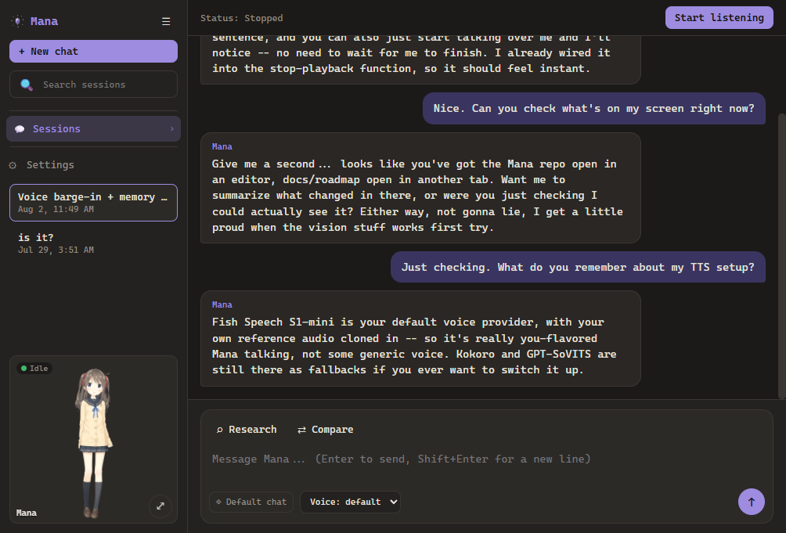
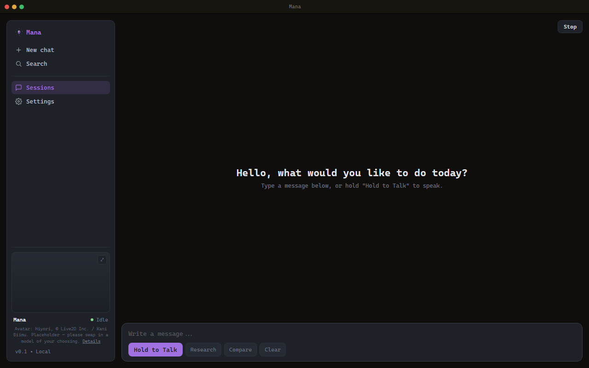
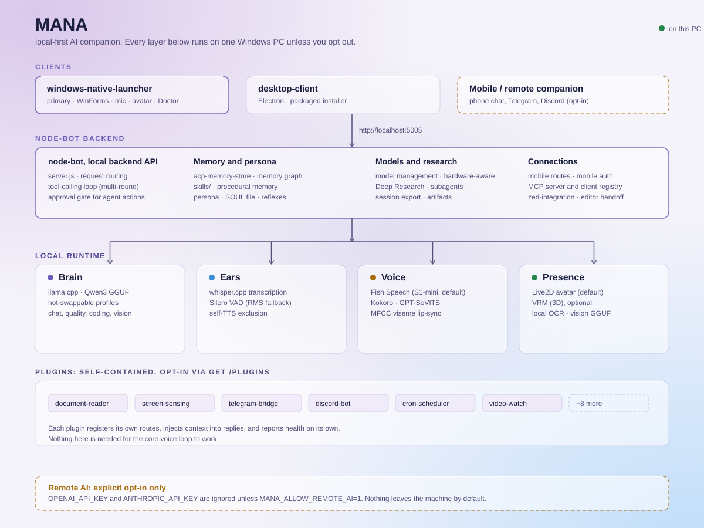

<h1 align="center">Mana</h1>

<p align="center">A local-first AI companion for Windows — she listens, thinks, remembers, and talks back without your voice or your conversations ever leaving your PC.</p>

<p align="center">
  <a href="LICENSE"></a>
  <a href="https://github.com/Yuuzulight/Mana/issues"></a>
  <a href="https://github.com/sponsors/Yuuzulight"></a>
</p>

<p align="center">
  
  
  
  
  
  
</p>

<p align="center">
  [<a href="https://github.com/Yuuzulight/Mana/issues">Report a bug</a>]
  [<a href="https://github.com/Yuuzulight/Mana/discussions">Discussions</a>]
  [<a href="https://github.com/sponsors/Yuuzulight">Sponsor</a>]
  [<a href="docs/quick_start_windows.md">Quick start</a>]
</p>

**License (code): Apache License 2.0 — © 2026 Mashiron Labs.** See LICENSE and NOTICE.

**Artwork (images/sprites/avatar models): All rights reserved.** The images in `sprites/` and any avatar model files are proprietary and may not be reused without permission; see LICENSE-ARTWORK.

**Live2D Cubism Core** is proprietary to Live2D Inc., is not part of this repository, and is fetched at setup time under Live2D's own terms; see THIRD_PARTY.md.

Talking to a cloud AI assistant means handing your voice, your screen, and every conversation to someone else's servers. Character platforms and cloud VTuber stacks get you a voice and a face, but the moment their servers go down or the subscription lapses, so does the companion. Mana takes the other path: transcription, replies, TTS, memory, and screen awareness all run on your own Windows PC, so the assistant is actually yours — it works offline, it doesn't meter you, and nothing you say to it leaves the machine unless you explicitly turn that on.

Mana is a personal project: it's built for one Windows setup, with local models by default, clear setup checks, and optional companion features when you want phone access or avatar control. It's shared openly, and it's meant to grow into something other people can install. That's future work, not a promise.

### Why Mana?

Mana is for people who want an always-listening voice assistant on their desktop without handing everything they say to a third party. It's built for one real Windows setup rather than as a hosted product, so setup, configuration, and troubleshooting stay in your hands instead of waiting on a vendor. If you've wanted a JARVIS-style companion that lives on your machine, has a face, and doesn't come with a monthly bill, this is that project.

### How is Mana different?

- 🔒 **Privacy-first, not privacy-optional** — local `llama.cpp` replies, local Whisper transcription, local TTS, and local OCR by default; `OPENAI_API_KEY` is ignored unless you explicitly opt into remote AI.
- 🎙️ **Voice-native, not one-shot** — say the wake word once (`Mana` or `wake up`) and keep talking, instead of re-triggering per question like a push-to-talk command. Talk over her mid-reply (hotkey or just your voice) and she stops to listen, instead of finishing a sentence you already interrupted.
- 🧩 **One integrated loop, not five disconnected tools** — transcription, LLM reply, TTS, and screen OCR are wired together into a single conversation instead of scripts you have to glue yourself.
- 🛠️ **Developer-friendly, not a black box** — Mana can open files in Zed or VS Code, propose edits for review instead of silently applying them, and can even run as a Zed External Agent.
- 🎭 **A presence, not just a reply** — a Live2D or VRM avatar with lip sync and emotion reactions, plus a gaming mode that backs off while you're playing, so it feels like a companion on your desktop rather than a chatbot tab.
- 🧠 **Remembers between conversations, not just within one** — idle-triggered memory consolidation, cross-session entity tagging, and a durable persona file mean Mana's sense of "you" outlives any single chat window.

### Related projects

[Project AIRI](https://github.com/moeru-ai/airi) (web/desktop) and [Open-LLM-VTuber](https://github.com/t41372/Open-LLM-VTuber) (Python, cross-platform) explore the same local, always-on companion space from different angles. Mana's voice barge-in was inspired by how both treat mid-speech interruption as a basic part of the experience.

## Preview

https://github.com/user-attachments/assets/639fd9b4-3f1e-4a58-aa02-79b56572306c

<p align="center"><sub>Mana's debut: a 48-second self-introduction in her own voice (Fish Speech), rendered with the same Live2D runtime the launchers use. The avatar is Live2D's Hiyori sample model, standing in until Mana's own model is finished.</sub></p>

<p align="center">
  
  
</p>
<p align="center"><sub>The retired Electron launcher (left, kept as a fallback; see <a href="docs/legacy_launcher.md">the legacy launcher notes</a>) and desktop-client (right). The native launcher's screenshot hasn't been added here yet.</sub></p>

## Quick Start

The current supported path is the native Windows launcher plus the local Node backend. Run these from the repo root, wherever you cloned it:

```powershell
cd node-bot
npm install

cd ..\windows-native-launcher
powershell -File pack-folio.ps1
dotnet build
dotnet run
```

Requires the .NET 10 SDK (not just the runtime) and git. `pack-folio.ps1` builds the [Folio](https://github.com/Yuuzulight/Folio) packages that draw HTML artifacts into `windows-native-launcher\folio-feed`, the local package source in `nuget.config`, from the Folio commit the launcher pins. Run it again whenever the pin changes. To bump Folio, set `FolioCommit` in `ManaNativeLauncher.csproj` to a Folio commit on main and `FolioVersion` to `0.1.0-m1.N`, where N is `git rev-list --count <commit>` in Folio; the script stops if the two don't match.

For the full setup flow, including model paths, Whisper, TTS services, gaming mode, and optional market helpers, see [docs/quick_start_windows.md](docs/quick_start_windows.md) and [docs/native_launcher_plan.md](docs/native_launcher_plan.md).

## Highlights

- **Local AI by default**: Mana uses local `llama.cpp` models unless remote AI is explicitly enabled. See [Model Stack](#model-stack).
- **Voice loop**: wake Mana once with `Mana` or `wake up`, then keep talking without repeating the wake word.
- **Voice barge-in**: interrupt Mana mid-reply with a hotkey or just by talking over her, on by default. See [docs/roadmap/issue-219-voice-barge-in.md](docs/roadmap/issue-219-voice-barge-in.md).
- **Local transcription and speech output**: audio goes through `whisper.cpp`, and replies are spoken locally. Fish Speech is the default TTS provider; see [docs/fish_speech_tts.md](docs/fish_speech_tts.md).
- **Screen text awareness**: after Mana is awake, the launcher can capture the primary display and read the text on it locally.
- **Look-at-my-screen hotkey**: press `Ctrl+Alt+Shift+M` (remappable in Settings > Hotkeys) to have Mana describe the screen and speak the answer. See [docs/vision_setup.md](docs/vision_setup.md).
- **Desktop avatar support**: Mana emotes through a built-in Live2D avatar with lip sync and emotion reactions. See [docs/live2d_avatar_setup.md](docs/live2d_avatar_setup.md).
- **Editor coding handoff**: Mana can open projects or files in Zed or VS Code and propose edits for review. See [Editor Integration](#editor-integration).
- **Memory between conversations**: memories link across sessions and are consolidated while she's idle, so what she learns outlives one chat.
- **OpenAI-compatible API**: `/v1/chat/completions`, `/v1/embeddings`, and `/v1/models` let external tools talk to Mana's local backend. See [Backend API](#backend-api).

More features, including gaming mode, Deep Research, the MCP server and the plugins, are listed in [docs/features.md](docs/features.md).

## Support Development

Mana is built by one person in spare time. If it's useful to you, sponsoring helps the roadmap move, such as the native launcher's avatar work. **[Sponsor development on GitHub Sponsors](https://github.com/sponsors/Yuuzulight).** Using Mana and filing issues helps too.

## Architecture

Mana is split into small runtime pieces, all talking to one local backend over `http://localhost:5005`. Nothing below the "Remote AI" box at the bottom leaves your PC unless you explicitly turn it on.

<p align="center">
  
</p>

```text
Mana/
├── windows-native-launcher/  # The primary launcher: C#/.NET WinForms (docs/native_launcher_plan.md)
├── windows-launcher/         # Retired Electron launcher, kept as a fallback (docs/legacy_launcher.md)
├── desktop-client/           # Electron chat client with a packaged installer
├── node-bot/                 # Local backend API (http://localhost:5005)
├── plugins/                  # Optional feature plugins (plugins/README.md)
├── tts-service/              # Local TTS service
├── zed-agent/                # Zed External Agent entry point (docs/zed_external_agent.md)
├── tools/                    # Expected places for whisper.cpp and llama.cpp binaries and models
└── docs/                     # Setup guides and roadmap notes
```

## Local AI And Privacy

Mana is designed to run on your machine instead of depending on a hosted assistant stack.

Default behavior:

- `OPENAI_API_KEY` is ignored unless `MANA_ALLOW_REMOTE_AI=1`.
- Local replies use the configured `LLAMA_BIN` and `LLAMA_MODEL`.
- Audio transcription uses local Whisper binaries.
- Screen awareness uses local OCR through `tesseract.js`.
- Chat summaries and mobile memory are stored locally unless you intentionally sync or expose them.
- Web search runs through a local SearXNG instance (no third-party search API, no key); wiki lookups and page reads Mana is pointed at do reach the public internet, since that's inherent to what they do. See [docs/web_access_setup.md](docs/web_access_setup.md). Set `MANA_WEB_ACCESS_ENABLED=0` to turn all of it off.

Remote AI is an explicit escape hatch, not the default path.

## Configuration

These are the variables most setups change. [`node-bot/.env.sample`](node-bot/.env.sample) has the core settings, with a comment on each. Feature-specific variables are in their own docs.

| Variable | Purpose |
|---|---|
| `LLAMA_BIN` | Path to the `llama.cpp` binary used for local replies |
| `LLAMA_MODEL` | Path to the active GGUF model; unset, Mana picks one from [Model Stack](#model-stack) |
| `WHISPER_BIN` / `WHISPER_MODEL` | Path to the `whisper.cpp` binary and its model |
| `TTS_PROVIDER` | TTS backend: `fish` (default), `kokoro`, `gpt-sovits`, or `qwen3tts` |
| `MANA_ALLOW_REMOTE_AI` | Set to `1` to opt into remote AI; unset or `0` keeps everything local |
| `OPENAI_API_KEY` | Remote AI key, ignored unless `MANA_ALLOW_REMOTE_AI=1` |
| `MANA_BIND_HOST` | Address the backend listens on; loopback only by default. Read the note in `.env.sample` before changing it |
| `ADMIN_TOKEN` | Sent as the `x-admin-token` header by scripts; the launchers use their own per-run key |
| `MANA_WEB_ACCESS_ENABLED` | Set to `0` to disable local web search, wiki lookups, and page reads |

## Editor Integration

Mana can hand coding work to a local editor, Zed (the default) or VS Code. The integration runs in the local backend, so any launcher that talks to it can use it. Mana doesn't edit your code silently: her changes arrive as proposals you review first, and snapshots let you restore earlier states.

- **windows-launcher** (Electron, retired): reviews proposals and snapshots.
- **windows-native-launcher**: reviews proposals and snapshots. Opening a project or file in Zed or VS Code from the launcher is a future integration.

Setup, the editor variables, and the routes are in [docs/editor_integration.md](docs/editor_integration.md).

## Model Stack

These are the models Mana's code picks by default. Each profile tries its models in order and uses the first one found in your local model folders. Your own choices belong in `node-bot/.env` (see [Configuration](#configuration)).

| Profile | First choice | Falls back to |
|---|---|---|
| Default chat | `Qwen3-4B-Q4_K_M.gguf` | `qwen2.5-1.5b-instruct-q4_k_m.gguf`, then `Qwen3-8B-Q4_K_M.gguf` |
| Fast fallback | `Qwen3-1.7B-Q8_0.gguf` | `qwen2.5-1.5b-instruct-q4_k_m.gguf`, `Qwen3-4B-Q4_K_M.gguf`, `Qwen3-8B-Q4_K_M.gguf` |
| Quality | `Qwen3.5-9B-Q4_K_M.gguf` | `Qwen3-14B-Q4_K_M.gguf`, `Qwen3-8B-Q4_K_M.gguf`, `Qwen3-4B-Q4_K_M.gguf`, `qwen2.5-1.5b-instruct-q4_k_m.gguf` |
| Coding | `qwen2.5-coder-14b-instruct-q4_k_m.gguf` when present, else `qwen2.5-coder-7b-instruct-mana-imat-Q4_K_M.gguf` | `Qwen3-4B-Q4_K_M.gguf`, `qwen2.5-1.5b-instruct-q4_k_m.gguf`, `Qwen3-8B-Q4_K_M.gguf` |
| Vision (optional) | any vision GGUF with its `mmproj` file | see [docs/vision_setup.md](docs/vision_setup.md) |

Background memory review uses the fast fallback profile, since it doesn't need the same quality as a live reply.

## Doctor And Troubleshooting

Mana includes setup checks for the local runtime.

From the backend:

```powershell
cd node-bot
npm run doctor
```

From `windows-native-launcher`, use the **Doctor** panel and **Run checks** button.

The main checks cover:

- Node runtime, local AI policy, and llama binary and model paths
- Whisper configuration and local TTS health URLs
- Mobile auth configuration, storage writability, and backend port availability
- Zed and VS Code CLI availability, and the Zed External Agent entry point
- SearXNG web search
- The self-work sandbox, which her own tests run in on Windows

The Doctor panel shows every check.

Common troubleshooting:

- If the launcher reports `Local backend not reachable`, check port `5005` and run `npm run doctor`.
- If replies are placeholders, verify `LLAMA_BIN` and `LLAMA_MODEL`.
- If transcription fails, verify `WHISPER_BIN` and `WHISPER_MODEL`.
- If text replies work but no audio plays, check `TTS_PROVIDER` and the configured local TTS service.

## Docs By Goal

- [Windows quick start](docs/quick_start_windows.md): full setup and daily run flow.
- [Features](docs/features.md): everything Mana does, beyond the highlights.
- [Native launcher plan](docs/native_launcher_plan.md): the primary C#/WinForms launcher, its feature history and benchmarks.
- [Legacy launcher notes](docs/legacy_launcher.md): the retired Electron launcher, kept as a fallback.
- [Editor integration](docs/editor_integration.md): Zed and VS Code handoff, editor variables and routes.
- [Mobile PWA and Cloudflare Tunnel](docs/mobile_pwa_cloudflare.md): phone companion setup.
- [PNG avatar setup](docs/png_avatar_setup.md): desktop avatar overlay.
- [Live2D avatar setup](docs/live2d_avatar_setup.md): built-in VTuber avatar with lip sync.
- [VTube Studio setup](docs/vtube_studio_setup.md): avatar hotkeys and reactions.
- [GPT-SoVITS setup](docs/gpt_sovits_setup.md): trial anime-style voice-cloning provider.
- [Qwen3-TTS](docs/qwen3_tts.md): lighter voice-cloning provider (`TTS_PROVIDER=qwen3tts`).
- [Fish Speech TTS](docs/fish_speech_tts.md): the default speech provider.
- [Market analysis helper](docs/market_analysis_helper.md): stock-market helper setup.
- [Vision setup](docs/vision_setup.md): local image understanding with a vision GGUF.
- [Web access setup](docs/web_access_setup.md): local search (SearXNG), wiki lookups, and page reading.
- [Zed External Agent setup](docs/zed_external_agent.md): local Zed `agent_servers` configuration.
- [MCP support roadmap](docs/roadmap/issue-42-mcp-support.md): running Mana as an MCP server (`npm run mcp`) and the plan for MCP client support.
- [Deep Research roadmap](docs/roadmap/issue-47-deep-research.md): multi-step, multi-source research with a cited report.
- [Discord bot roadmap](docs/roadmap/issue-185-discord-bot.md) and [Discord voice channels roadmap](docs/roadmap/issue-187-discord-voice-channels.md): remote messaging and voice-channel companion support.
- [Code signing setup](docs/code_signing_setup.md): what's needed to get a signed, SmartScreen-clean desktop-client installer.
- [Auto-update setup](docs/auto_update_setup.md): how desktop-client checks for and installs updates.
- [Local data storage and uninstalling](docs/local_data_and_uninstall.md): where desktop-client's local data lives and what the uninstaller does.
- [First-run setup wizard](docs/first_run_setup_wizard.md): the guided on-ramp desktop-client shows until a local model and Whisper are configured.

## Backend API

The backend listens on `http://localhost:5005`. It only accepts connections from this PC (loopback) unless `MANA_BIND_HOST` says otherwise. Read `node-bot/.env.sample` before setting it, since anything that can reach the backend can make Mana reply and run tools (#670). Every route needs an admin key unless it's on the short public list in `node-bot/admin-key.js`: the launchers send their own per-run key, and scripts send `ADMIN_TOKEN` from `node-bot/.env` as the `x-admin-token` header.

Core routes:

| Method &amp; Path | Description |
|---|---|
| `GET /health` | Basic backend status |
| `GET /doctor` | Setup and readiness checks |
| `GET /plugins` | Loaded plugins, grouped by category (see [plugins/README.md](plugins/README.md)) |
| `POST /reply` | Text reply from Mana; accepts an optional `image` for vision replies |
| `POST /transcribe` | Audio upload, transcription, and reply |
| `POST /synthesize` | TTS audio for text |
| `POST /v1/chat/completions`, `POST /v1/embeddings`, `GET /v1/models` | OpenAI-compatible routes for external tools |

The editor, web, screen, market and FFXIV routes are listed in [node-bot/README.md](node-bot/README.md).

## Getting Help

- **Found a bug?** Open a [GitHub Issue](https://github.com/Yuuzulight/Mana/issues), and include your `npm run doctor` output for setup problems.
- **Have an idea or a feature request?** Start a thread in [GitHub Discussions](https://github.com/Yuuzulight/Mana/discussions). It's a better fit than Issues for "what if Mana could..." conversations.
- If Mana's useful to you, starring or sharing the repo is a small, free way to help a local-first alternative get found.

## Development

Setup, the test commands and the checks to run before pushing are in [CONTRIBUTING.md](CONTRIBUTING.md).

## Status

Mana is under active development. The supported path is:

```text
windows-native-launcher -> node-bot -> local Whisper / local Llama / local TTS
```

The native launcher is the primary, supported launcher. Its feature history and benchmarks are in [docs/native_launcher_plan.md](docs/native_launcher_plan.md). The Electron launcher is retired and kept only as a fallback. The next engineering priority is backend modularization, tracked in [issue #500](https://github.com/Yuuzulight/Mana/issues/500).
